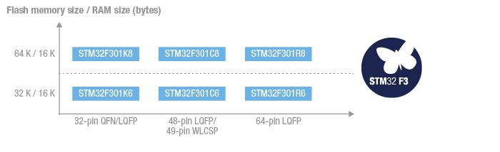

# [STM32F301](https://github.com/sochub/STM32F301) 
 
#### 父级：[STM32F3](https://github.com/sochub/STM32F3)
#### 架构：[Cortex M4](https://github.com/sochub/CM4) 
### [STM32F301简介](https://github.com/sochub/STM32F301/wiki)

ARM® Cortex®-M4 core (with FPU and DSP instructions) running at 72 MHz.

 

### 关键参数：

* Up to three ultra-fast comparators (25 nanoseconds)
* Op-Amp with programmable gain
* 12-bit DACs
* Ultra-fast 12-bit ADCs with 5 MSPS
* Fast 144 MHz motor control timers (resolution 7 nanoseconds)

* ROM: 32 to 64 Kbytes
* PIN: 32 to 64 pins

### [收录资源](https://github.com/sochub/STM32F301)

* [参考文档](docs/)
* [参考资源](src/)

### [关联资源](https://github.com/sochub)

* [编译工具](https://github.com/sochub/arm-none-eabi)

### [选型建议](https://github.com/sochub/STM32F301)

在STM32F3系列中，[STM32F301](https://github.com/sochub/STM32F301), STM32F302, [STM32F303](https://github.com/sochub/STM32F303)的差异在资源的数量上，所以在固件较小对IO数量要求不多的情况下，[STM32F301](https://github.com/sochub/STM32F301)是FOC控制很好的选择。

* 相同替换方案 [STM32F303](https://github.com/sochub/STM32F303) 
* 差异替换方案 [STM32F373](https://github.com/sochub/STM32F373) 

##  [SoC资源平台](http://www.qitas.cn)

