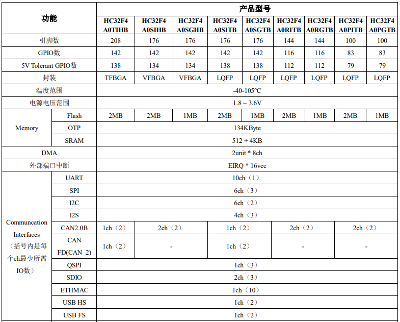

# [HC32F4A0](https://github.com/SoCXin/HC32F4A0)

*  [hdsc](https://www.hdsc.com.cn/)：[Cortex-M4](https://github.com/SoCXin/Cortex)
*  [Level](https://github.com/SoCXin/Level)：240 MHz (300DMIPS,825Coremarks)

## [简介](https://github.com/SoCXin/HC32F4A0/wiki)

[HC32F4A0](https://www.hdsc.com.cn/Category83-1499) 集成FPU、MPU，支持SIMD指令的DSP ，全指令跟踪单元ETM， 及CoreSight标准调试单元。最高工作主频 240MHz ，达到 300DMIPS或825Coremarks的运算性能。

#### 关键特性

* 最大32个通信接口 (10xUSART)
* 数学协处理单元（MAU），支持 Sin/Sqrt
* 516KByte SRAM
* 4ch 12bit 15MSPS DAC
* 16个 50ps高分辨率 PWM（HRPWM）
* 4个独立电压比较器（CMP）
* 4个可编程增益放大器（PGA）
#### 封装规格

* LQFP176 24×24mm
* LQFP144 20×20mm
* LQFP100 14×14mm
* VFBGA176 10×10mm
* TFBGA208 13×13mm

### [资源收录](https://github.com/SoCXin/HC32F4A0)

* [参考文档](docs/)
* [参考资源](src/)
* [参考工程](project/)

### [选型建议](https://github.com/SoCXin)

[HC32F4A0](https://github.com/SoCXin/HC32F4A0)

###  [探索芯世界 www.SoC.xin](http://www.SoC.Xin)
