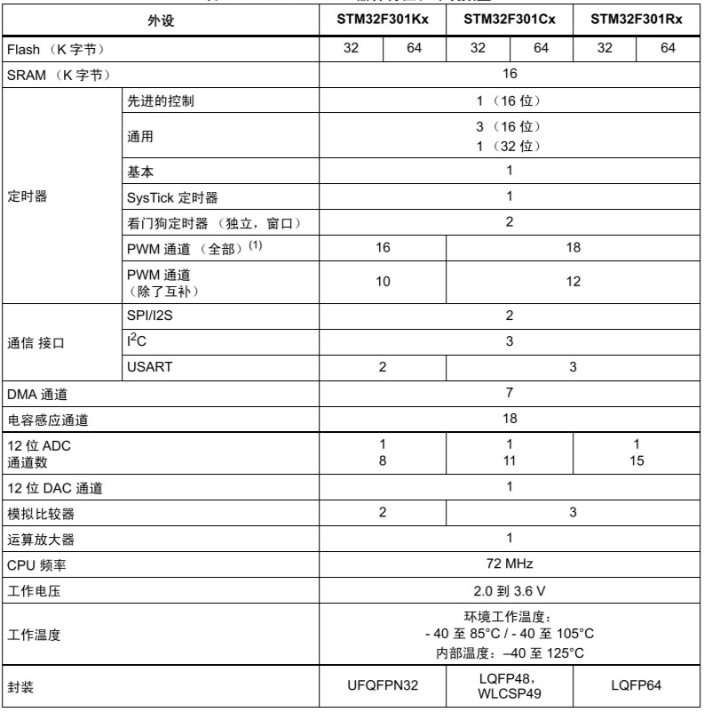

# [STM32F301](https://github.com/SoCXin/STM32F301)

#### [Vendor](https://github.com/SoCXin/Vendor) ：[ST](http://www.essemi.com/)
#### [Core](https://github.com/SoCXin/Cortex)：[Cortex M4](https://github.com/SoCXin/CM4)
#### [Level](https://github.com/SoCXin/Level) ：72MHz * 1.25DMIPS/MHz（245CoreMark）
### [STM32F301简介](https://github.com/SoCXin/STM32F301/wiki)

[STM32F301](https://www.st.com/content/st_com/zh/products/microcontrollers-microprocessors/stm32-32-bit-arm-cortex-mcus/stm32-mainstream-mcus/stm32f3-series/stm32f301.html#overview) 系列产品基于Cortex®-M4 内核

### 关键特性

* 5MSPS的超快速12位ADC
* 144 MHz电机控制定时器（分辨率7ns）
* 快速比较器（25 ns）
* 12位DAC
### [收录资源](https://github.com/SoCXin/STM32F301)

* [参考文档](docs/)
* [参考资源](src/)

### [选型建议](https://github.com/SoCXin/STM32F301)

在STM32F3系列中，[STM32F301](https://github.com/SoCXin/STM32F301), STM32F302, [STM32F303](https://github.com/SoCXin/STM32F303)的差异在资源的数量上，所以在固件较小对IO数量要求不多的情况下，[STM32F301](https://github.com/SoCXin/STM32F301)是FOC控制很好的选择。

* 相近替换方案 [STM32F303](https://github.com/SoCXin/STM32F303)
* 差异替换方案 [STM32F373](https://github.com/SoCXin/STM32F373)

###  [SoC芯平台](http://www.SoC.Xin)

